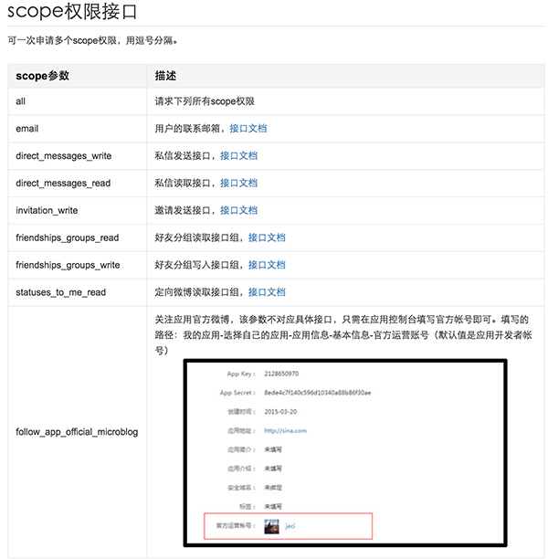

# react-native-social-kit
此项目志在提供对第三方社交SDK的功能封装，方便开发者在React Native应用中使用诸如授权、分享等功能。 

目前仅支持授权功能,仅覆盖微信、新浪微博、QQ。  

**项目仍在开发中，功能不稳定，请耐心等待。**

# Demo


# 安装
`npm install --save react-native-social-kit@latest`  

# 配置  
## iOS

需要使用[Cocoapods](https://cocoapods.org/)来管理依赖。*（诸如微信、QQ等第三方的官方SDK包含了大量依赖文件和Xcode配置，使用Cocoapods可以极大简化这些流程）*  

在Podfile里添加

 ```
target 'Demo' do

pod "react-native-social-kit", :path => '../node_modules/react-native-social-kit'

end
 ```
然后执行命令`pod install`。（*是不是很简单！*）

修改AppDelegate.m文件如下：

```objective-c

	#import "WeixinModule.h"
	#import "WeiboModule.h"
	#import "QQModule.h"
	#import "AliModule.h"
	...
  
	- (BOOL)application:(UIApplication *)application handleOpenURL:(NSURL *)url
	{
 		 return [WeixinModule handleOpenURL:url] || [WeiboModule handleOpenURL:url] || [QQModule handleOpenURL:url] || [AliModule handleUrl:url];
	}

	- (BOOL)application:(UIApplication *)application openURL:(NSURL *)url sourceApplication:(NSString *)sourceApplication annotation:(id)annotation
	{
  		return [WeixinModule handleOpenURL:url] || [WeiboModule handleOpenURL:url] || [QQModule handleOpenURL:url] || [AliModule handleUrl:url];
	}
```


##### 此外，为了适配iOS9.0中的App Transport Security(ATS)对http的限制，需要在info.plist中修改配置

```
<key>NSAppTransportSecurity</key>
    <dict>    
        <key>NSAllowsArbitraryLoads</key><true/>
    </dict>
```

##### 或者针对指定域名开放权限，以支付宝为例：

```
<key>NSAppTransportSecurity</key>
    <dict>
        <key>NSExceptionDomains</key>
        <dict>
            <key>alipay.com</key>
            <dict>
                <key>NSIncludesSubdomains</key>
                <true/>
                <key>NSTemporaryExceptionAllowsInsecureHTTPLoads</key>
                <true/>
                <key>NSTemporaryExceptionMinimumTLSVersion</key>
                <string>TLSv1.0</string>
                <key>NSTemporaryExceptionRequiresForwardSecrecy</key>
                <false/>
            </dict>
            <key>alipayobjects.com</key>
            <dict>
                <key>NSIncludesSubdomains</key>
                <true/>
                <key>NSTemporaryExceptionAllowsInsecureHTTPLoads</key>
                <true/>
                <key>NSTemporaryExceptionMinimumTLSVersion</key>
                <string>TLSv1.0</string>
                <key>NSTemporaryExceptionRequiresForwardSecrecy</key>
                <false/>
            </dict>
        </dict>
    </dict>
```

##### 微信

在**Xcode**中选中**TARGETS**，在**info**标签栏的**URL Types**项目下添加子项，子项的**URL Schemes**为你所注册的应用程序的AppId。

```
<key>LSApplicationQueriesSchemes</key>
<array>
    <string>wechat</string>
	<string>weixin</string>
</array>
```

##### 微博

在**Xcode**中选中**TARGETS**，在**info**标签栏的**URL Types**项目下添加子项，子项的**URL Schemes**为“wb” ＋ 你所注册的应用程序的App Key，如“wb204543436852”。

在你的app的plist中添加如下键值对：

```
<key>LSApplicationQueriesSchemes</key>
<array>
    <string>sinaweibohd</string>
    <string>sinaweibo</string>
    <string>weibosdk</string>
    <string>weibosdk2.5</string>
</array>
```

##### QQ

在**Xcode**中选中**TARGETS**，在**info**标签栏的**URL Types**项目下添加子项，子项的**URL Schemes**为“tencent” ＋ 你所注册的应用程序的App Key，如“tencent222222”。

在你的app的plist中添加如下键值对：

```
<key>LSApplicationQueriesSchemes</key>
<array>
    <string>mqzone</string>
	<string>wtloginmqq2</string>
	<string>mqqopensdkapiV3</string>
	<string>mqqwpa</string>
	<string>mqqopensdkapiV2</string>
	<string>mqqOpensdkSSoLogin</string>
	<string>mqq</string>
</array>
```

##### 支付宝

在**Xcode**中选中**TARGETS**，在**info**标签栏的**URL Types**项目下添加子项，子项的**URL Schemes**为你实际app的scheme名称。

```
<key>LSApplicationQueriesSchemes</key>
<array>
    <string>alipay</string>
    <string>alipayshare</string>
</array>
```


## Android

请依次修改以下文件：

```
// file: settings.gradle
...
include ':react-native-social-kit'
project(':react-native-social-kit').projectDir = new File(settingsDir, '../node_modules/react-native-social-kit/android')
```

```
// file: app/build.gradle
...
dependencies {
    ...
    compile project(':react-native-social-kit')
}
```

```Java
// file: MainActivity.java
...
import com.yoai.reactnative.socialsdk.SocialPackage;
...
public class MainActivity extends ReactActivity {
	...
	
    /**
     * A list of packages used by the app. If the app uses additional views
     * or modules besides the default ones, add more packages here.
     */
    @Override
    protected List<ReactPackage> getPackages() {
        return Arrays.<ReactPackage>asList(
            new MainReactPackage(),
            new SocialPackage() // Add our package
        );
    }
}
```

如果需要代码混淆，为了保证第三方SDK的正常使用，需要在proguard配置中加上：

```
-keep class com.tencent.mm.sdk.** {
   *;
}
```


##### 微信

在你的包名相应目录下新建一个wxapi目录，并在该wxapi目录下新增一个***WXEntryActivity***类，该类继承自***com.yoai.reactnative.social.weixin.WXEntryActivity***。

在AndroidManifest.xml里添加：

```
<activity
  android:name=".wxapi.WXEntryActivity"
  android:exported="true"
  android:label="@string/app_name"
  android:theme="@android:style/Theme.Translucent.NoTitleBar"
  />
```

##### 微博

不需要额外配置

##### QQ

在AndroidManifest.xml里添加：

```
<activity
  android:name="com.tencent.tauth.AuthActivity"
  android:launchMode="singleTask"
  android:noHistory="true">
  <intent-filter>
    <action android:name="android.intent.action.VIEW"/>
    <category android:name="android.intent.category.DEFAULT"/>
    <category android:name="android.intent.category.BROWSABLE"/>

    <data android:scheme="tencent222222"/>
  </intent-filter>
</activity>
```

***注意其中的“tencent222222”格式为“tencent”＋你所注册的应用程序的App Key，记得替换。***


# 使用

In your JavaScript code:

```
import SocialKit from 'react-native-social-kit';
const {Weibo, Weixin, QQ, Ali} = SocialKit;
```

or simply

```
import {Weibo, Weixin, QQ, Ali} from 'react-native-social-kit';
```
Then, use it like:

```
Weibo.authorize({
  scope: "all",
  redirectUrl: 'https://api.weibo.com/oauth2/default.html'
}, (data) => {
  if (data.error) {
    //发生了错误
  } else if (data.cancel) {
    //用户取消了授权
  } else {
    console.log(JSON.stringify(data));
  }
});
```


# 注册App

##### SDKNAME.registerApp(appId/appKey, (data) => {

##### })


SDKNAME表示Weixin、Weibo、QQ ,Ali 下同

使用授权登陆等功能之前首先需要注册App,在js端写入如下代码 以QQ为例

```
  componentWillMount() {
    // 注册App
    QQ.registerApp(
      appId: "222222"
    , (data) => {
    });
  }
```

###### 参数配置

| SDKNAME         | appKey/appId          | 
| ----------------| --------------------- |
| Weixin          | appId                 | 
| Weibo           | appKey                |
| QQ              | appId                 |


# 授权登陆API

##### SDKNAME.authorize(config, (data) => {

##### })


###### config

*"OK"表示有此参数，"NA"表示没有此参数，"Not Yet"表示有此参数但是待实现。*

| key         | value                                    | Weixin |  Weibo  |   QQ    |
| ----------- | ---------------------------------------- | ------ | :-----: | :-----: |
| redirectUrl | 微博授权回调页，可不填，默认为"https://api.weibo.com/oauth2/default.html"， | NA     |   OK    |   NA    |
| scope①       | 授权的权限范围，可不填，默认最低权限                       | NA     | OK | NA |
| permissions② | 发送授权范围请求       | NA     | NA | OK |

①:scope 传入字符串,为微博权限范围 默认为"",详见下图



②:permissions,传入数组,为QQ权限范围,默认为 [kOPEN_PERMISSION_ADD_SHARE,kOPEN_PERMISSION_GET_USER_INFO,kOPEN_PERMISSION_GET_SIMPLE_USER_INFO] 详细参数见下图 


###### data

通用授权结果

| key    | value             | Weixin | Weibo |  QQ  |
| ------ | ----------------- | :----: | :---: | :--: |
| error  | 如果存在此字段，表示发生了错误   |   OK   |  OK   |  OK  |
| cancel | 如果为true，表示用户取消了授权 |   OK   |  OK   |  OK  |

微信授权结果

| key     | value |
| ------- | ----- |
| code    |       |
| country |       |
| lang    |       |

微博授权结果

| key              | value |
| ---------------- | ----- |
|requestUserInfo   |       |
| uid              |       |
| accessToken      |       |
| refreshToken     |       |
| expiresInSeconds |       |

QQ授权结果

| key              | value |
| ---------------- | ----- |
| openId           |       |
| accessToken      |       |
| expiresInSeconds |       |

以微信为例,授权代码如下

```
 auth() {
    Weixin.authorize(null, this.apiCallback.bind(this));
  }
```
# 分享API 

##### SDKNAME.share(config, (data) => {

##### })

config内配置内容参数见下表

| 分享内容              | scene①|title |description|thumb② |data③  |text④ |image④ |webpage|music|video |
| ---------------------| ------|------|-----------|--------|--------|------|--------|-------|-----|------|
| text                 |   选填 |  -   |      -    | -      |     -  |必填  |-       |-       |    -|    -|
| image                |   选填 |   -  |    -      |    -   |     -  |    -|     必填|       -|    -|    -| 
| webpage              |   选填 |  选填 |    选填   |  选填   |  选填   |-    |-       |必填     |-    |-    |
| music                |   选填 |  选填 |    选填   |  选填   |  选填   |-    |-       |-       |必填  |-    |
| video                |   选填 |  选填 |    选填   |  选填   |  选填   |-    |-       |-       |-    |  必填|


①: 微信Scene默认为'session'(对话),可选'timeline'(朋友圈),'favorite'(收藏).微博没有scene参数,QQ此参数默认为'qq'(对话),可选'qzone'(QQ空间).

②: thumb为缩略图链接地址,微信,微博对缩略图的大小限制在32k,如传入的图片大小超过32k,则会被压缩到32K以内.

③: data参数表示实际数据链接,如分享music时data表示后缀为.mp3的url.

④: 在微博中 text,image 于其他多媒体链接分别独立,可以同时分享(iOS端图片和多媒体暂时无法同时分享).QQ分享中,text与image配置title,description,thumb,属性生效.

以微信图片分享为例,代码如下

```
shareImage(scene) {
    Weixin.share({
      image:'http://static.yoaicdn.com/shoppc/images/cover_img_e1e9e6b.jpg',
      scene: scene,
    }, this.shareCallback.bind(this));
  }
```

具体参数配置见[Demo](./ShareSDKDemo)

# 支付API 

##### SDKNAME.pay(
##### config, 
##### (data) => {

#####  }
##### )

###### config参数配置

| SDKNAME         | config                | 
| ----------------| --------------------- |
| Weixin          | {timestamp:'',partnerid:'',prepayid:'',noncestr:'',timeStamp:'',package:'',sign:''} android需要添加appId         | 
| Ali             | {orderString: '',appScheme:''}          |


# 关于我们

成员

- [ldn0x7dc](https://github.com/ldn0x7dc)
- [yuanyuli](https://github.com/yuanyuli)

组织

- [yoaicom](https://github.com/yoaicom)


